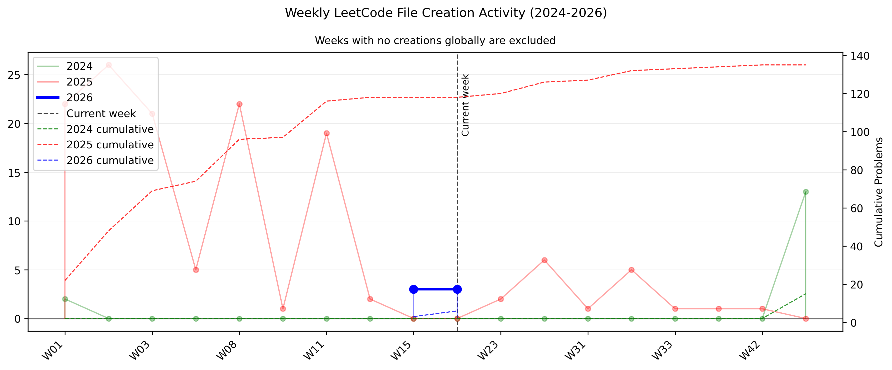

# LeetCode Solutions 🚀

Sharpening my problem-solving skills and doing this for fun.

_Last updated: 23 Apr 2026_

---

## 📊 Stats

- **Total Problems Solved:** 160
- **Difficulty Breakdown:**
  - 🟢 Easy: 125
  - 🟡 Medium: 34
  - 🔴 Hard: 1

---

## 📈 Activity Graph

---

## 📝 Problems Table

| #    | Problem Name                                                    | Difficulty | Solved on   | Solution                                                                                               |
| ---- | --------------------------------------------------------------- | ---------- | ----------- | ------------------------------------------------------------------------------------------------------ |
| 1    | Two Sum                                                         | 🟢 Easy    | 08 Jan 2025 | [View](./0001E%20Two%20Sum.py)                                                                         |
| 2    | Add Two Numbers                                                 | 🟡 Medium  | 09 Jun 2025 | [View](./0002M%20Add%20Two%20Numbers.py)                                                               |
| 3    | Longest Substring Without Repeating Characters                  | 🟡 Medium  | 18 Mar 2025 | [View](./0003M%20Longest%20Substring%20Without%20Repeating%20Characters.py)                            |
| 4    | Median of Two Sorted Arrays                                     | 🔴 Hard    | 21 Feb 2025 | [View](./0004H%20Median%20of%20Two%20Sorted%20Arrays.py)                                               |
| 11   | Container With Most Water                                       | 🟡 Medium  | 13 Jan 2025 | [View](./0011M%20Container%20With%20Most%20Water.py)                                                   |
| 13   | Roman to Integer                                                | 🟢 Easy    | 16 Mar 2025 | [View](./0013E%20Roman%20to%20Integer.py)                                                              |
| 17   | Letter Combinations of a Phone Number                           | 🟡 Medium  | 16 Mar 2025 | [View](./0017M%20Letter%20Combinations%20of%20a%20Phone%20Number.py)                                   |
| 20   | Valid Parentheses                                               | 🟢 Easy    | 29 Dec 2024 | [View](./0020E%20Valid%20Parentheses.py)                                                               |
| 21   | Merge Two Sorted Lists                                          | 🟢 Easy    | 09 Jun 2025 | [View](./0021E%20Merge%20Two%20Sorted%20Lists.py)                                                      |
| 22   | Generate Parentheses                                            | 🟡 Medium  | 16 Mar 2025 | [View](./0022M%20Generate%20Parentheses.py)                                                            |
| 26   | Remove Duplicates from Sorted Array                             | 🟢 Easy    | 24 Dec 2024 | [View](./0026E%20Remove%20Duplicates%20from%20Sorted%20Array.py)                                       |
| 27   | Remove Element                                                  | 🟢 Easy    | 24 Dec 2024 | [View](./0027E%20Remove%20Element.py)                                                                  |
| 33   | Search in Rotated Sorted Array                                  | 🟡 Medium  | 08 Aug 2025 | [View](./0033M%20Search%20in%20Rotated%20Sorted%20Array.py)                                            |
| 35   | Search Insert Position                                          | 🟢 Easy    | 11 Feb 2025 | [View](./0035E%20Search%20Insert%20Position.py)                                                        |
| 48   | Rotate Image                                                    | 🟡 Medium  | 07 Mar 2025 | [View](./0048M%20Rotate%20Image.py)                                                                    |
| 50   | Pow(x, n)                                                       | 🟡 Medium  | 07 Apr 2026 | [View](./0050M%20Pow%28x%2C%20n%29.py)                                                                 |
| 53   | Maximum Subarray                                                | 🟡 Medium  | 07 Apr 2026 | [View](./0053M%20Maximum%20Subarray.py)                                                                |
| 58   | Length of Last Word                                             | 🟢 Easy    | 24 Dec 2024 | [View](./0058E%20Length%20of%20Last%20Word.py)                                                         |
| 66   | Plus One                                                        | 🟢 Easy    | 02 Jan 2025 | [View](./0066E%20Plus%20One.py)                                                                        |
| 69   | Sqrt(x)                                                         | 🟢 Easy    | 12 Feb 2025 | [View](./0069E%20Sqrt%28x%29.py)                                                                       |
| 70   | Climbing Stairs                                                 | 🟢 Easy    | 08 Aug 2025 | [View](./0070E%20Climbing%20Stairs.py)                                                                 |
| 74   | Search a 2D Matrix                                              | 🟡 Medium  | 15 Aug 2025 | [View](./0074M%20Search%20a%202D%20Matrix.py)                                                          |
| 75   | Sort Colors                                                     | 🟡 Medium  | 10 Jan 2025 | [View](./0075M%20Sort%20Colors.py)                                                                     |
| 88   | Merge Sorted Array                                              | 🟢 Easy    | 04 Jan 2025 | [View](./0088E%20Merge%20Sorted%20Array.py)                                                            |
| 121  | Best Time to Buy and Sell Stock                                 | 🟢 Easy    | 13 Jan 2025 | [View](./0121E%20Best%20Time%20to%20Buy%20and%20Sell%20Stock.py)                                       |
| 125  | Valid Palindrome                                                | 🟢 Easy    | 24 Dec 2024 | [View](./0125E%20Valid%20Palindrome.py)                                                                |
| 136  | Single Number                                                   | 🟢 Easy    | 24 Dec 2024 | [View](./0136E%20Single%20Number.py)                                                                   |
| 150  | Evaluate Reverse Polish Notation                                | 🟡 Medium  | 15 Mar 2025 | [View](./0150M%20Evaluate%20Reverse%20Polish%20Notation.py)                                            |
| 153  | 3Sum                                                            | 🟡 Medium  | 13 Jan 2025 | [View](./0153M%203Sum.py)                                                                              |
| 155  | Min Stack                                                       | 🟡 Medium  | 15 Mar 2025 | [View](./0155M%20Min%20Stack.py)                                                                       |
| 167  | Two Sum II - Input Array Is Sorted                              | 🟡 Medium  | 13 Jan 2025 | [View](./0167M%20Two%20Sum%20II%20-%20Input%20Array%20Is%20Sorted.py)                                  |
| 169  | Majority Element                                                | 🟢 Easy    | 13 Mar 2025 | [View](./0169E%20Majority%20Element.py)                                                                |
| 191  | Number of 1 Bits                                                | 🟢 Easy    | 23 Dec 2024 | [View](./0191E%20Number%20of%201%20Bits.py)                                                            |
| 198  | House Robber                                                    | 🟡 Medium  | 08 Aug 2025 | [View](./0198M%20House%20Robber.py)                                                                    |
| 202  | Happy Number                                                    | 🟢 Easy    | 04 Jan 2025 | [View](./0202E%20Happy%20Number.py)                                                                    |
| 204  | Count Primes                                                    | 🟡 Medium  | 23 Apr 2026 | [View](./0204M%20Count%20Primes.py)                                                                    |
| 206  | Reverse Linked List                                             | 🟢 Easy    | 08 Jun 2025 | [View](./0206E%20Reverse%20Linked%20List.py)                                                           |
| 219  | Contains Duplicate II                                           | 🟢 Easy    | 16 Mar 2025 | [View](./0219E%20Contains%20Duplicate%20II.py)                                                         |
| 225  | Implement Stack using Queues                                    | 🟢 Easy    | 23 Dec 2024 | [View](./0225E%20Implement%20Stack%20using%20Queues.py)                                                |
| 238  | Product of Array Except Self                                    | 🟡 Medium  | 18 Mar 2025 | [View](./0238M%20Product%20of%20Array%20Except%20Self.py)                                              |
| 268  | Missing Number                                                  | 🟢 Easy    | 13 Mar 2025 | [View](./0268E%20Missing%20Number.py)                                                                  |
| 292  | Nim Game                                                        | 🟢 Easy    | 14 Jan 2025 | [View](./0292E%20Nim%20Game.py)                                                                        |
| 347  | Top K Frequent Elements                                         | 🟢 Easy    | 02 Jan 2025 | [View](./0347E%20Top%20K%20Frequent%20Elements.py)                                                     |
| 349  | Intersection of Two Arrays                                      | 🟢 Easy    | 04 Jan 2025 | [View](./0349E%20Intersection%20of%20Two%20Arrays.py)                                                  |
| 350  | Intersection of Two Arrays II                                   | 🟢 Easy    | 13 Mar 2025 | [View](./0350E%20Intersection%20of%20Two%20Arrays%20II.py)                                             |
| 367  | Valid Perfect Square                                            | 🟢 Easy    | 31 Jul 2025 | [View](./0367E%20Valid%20Perfect%20Square.py)                                                          |
| 387  | First Unique Character in a String                              | 🟢 Easy    | 11 Mar 2025 | [View](./0387E%20First%20Unique%20Character%20in%20a%20String.py)                                      |
| 414  | Third Maximum Number                                            | 🟢 Easy    | 24 Dec 2024 | [View](./0414E%20Third%20Maximum%20Number.py)                                                          |
| 448  | Find All Numbers Disappeared in an Array                        | 🟢 Easy    | 24 Dec 2024 | [View](./0448E%20Find%20All%20Numbers%20Disappeared%20in%20an%20Array.py)                              |
| 455  | Assign Cookies                                                  | 🟢 Easy    | 24 Dec 2024 | [View](./0455E%20Assign%20Cookies.py)                                                                  |
| 463  | Island Perimeter                                                | 🟢 Easy    | 02 Jan 2025 | [View](./0463E%20Island%20Perimeter.py)                                                                |
| 485  | Max Consecutive Ones                                            | 🟢 Easy    | 08 Jan 2025 | [View](./0485E%20Max%20Consecutive%20Ones.py)                                                          |
| 500  | Keyboard Row                                                    | 🟢 Easy    | 24 Dec 2024 | [View](./0500E%20Keyboard%20Row.py)                                                                    |
| 540  | Single Element in a Sorted Array                                | 🟡 Medium  | 23 Apr 2026 | [View](./0540M%20Single%20Element%20in%20a%20Sorted%20Array.py)                                        |
| 566  | Reshape the Matrix                                              | 🟢 Easy    | 07 Jan 2025 | [View](./0566E%20Reshape%20the%20Matrix.py)                                                            |
| 605  | Can Place Flowers                                               | 🟢 Easy    | 02 Jan 2025 | [View](./0605E%20Can%20Place%20Flowers.py)                                                             |
| 704  | Binary Search                                                   | 🟢 Easy    | 24 Dec 2024 | [View](./0704E%20Binary%20Search.py)                                                                   |
| 739  | Daily Temperatures                                              | 🟡 Medium  | 16 Mar 2025 | [View](./0739M%20Daily%20Temperatures.py)                                                              |
| 747  | Largest Number At Least Twice of Others                         | 🟢 Easy    | 16 Jan 2025 | [View](./0747E%20Largest%20Number%20At%20Least%20Twice%20of%20Others.py)                               |
| 766  | Toeplitz Matrix                                                 | 🟢 Easy    | 07 Jan 2025 | [View](./0766E%20Toeplitz%20Matrix.py)                                                                 |
| 771  | Jewels and Stones                                               | 🟢 Easy    | 18 Feb 2025 | [View](./0771E%20Jewels%20and%20Stones.py)                                                             |
| 797  | All Paths From Source to Target                                 | 🟡 Medium  | 13 Mar 2025 | [View](./0797M%20All%20Paths%20From%20Source%20to%20Target.py)                                         |
| 804  | Unique Morse Code Words                                         | 🟢 Easy    | 21 Feb 2025 | [View](./0804E%20Unique%20Morse%20Code%20Words.py)                                                     |
| 819  | Most Common Word                                                | 🟢 Easy    | 01 Jan 2025 | [View](./0819E%20Most%20Common%20Word.py)                                                              |
| 832  | Flipping an Image                                               | 🟢 Easy    | 06 Jan 2025 | [View](./0832E%20Flipping%20an%20Image.py)                                                             |
| 852  | Peak Index in a Mountain Array                                  | 🟡 Medium  | 23 Apr 2026 | [View](./0852M%20Peak%20Index%20in%20a%20Mountain%20Array.py)                                          |
| 867  | Transpose Matrix                                                | 🟢 Easy    | 03 Jan 2025 | [View](./0867E%20Transpose%20Matrix.py)                                                                |
| 876  | Middle of the Linked List                                       | 🟢 Easy    | 09 Jun 2025 | [View](./0876E%20Middle%20of%20the%20Linked%20List.py)                                                 |
| 914  | X of a Kind in a Deck of Cards                                  | 🟢 Easy    | 22 Feb 2025 | [View](./0914E%20X%20of%20a%20Kind%20in%20a%20Deck%20of%20Cards.py)                                    |
| 976  | Largest Perimeter Triangle                                      | 🟢 Easy    | 28 Sep 2025 | [View](./0976E%20Largest%20Perimeter%20Triangle.py)                                                    |
| 977  | Squares of a Sorted Array                                       | 🟢 Easy    | 10 Mar 2025 | [View](./0977E%20Squares%20of%20a%20Sorted%20Array.py)                                                 |
| 989  | Add to Array Form of Integer                                    | 🟢 Easy    | 01 Jan 1980 | [View](./0989E%20Add%20to%20Array%20Form%20of%20Integer.py)                                            |
| 1025 | Divisor Game                                                    | 🟢 Easy    | 06 Jan 2025 | [View](./1025E%20Divisor%20Game.py)                                                                    |
| 1037 | Valid Boomerang                                                 | 🟢 Easy    | 01 Jan 1980 | [View](./1037E%20Valid%20Boomerang.py)                                                                 |
| 1108 | Defanging an IP Address                                         | 🟢 Easy    | 18 Feb 2025 | [View](./1108E%20Defanging%20an%20IP%20Address.py)                                                     |
| 1143 | Longest Common Subsequence                                      | 🟡 Medium  | 08 Aug 2025 | [View](./1143M%20Longest%20Common%20Subsequence.py)                                                    |
| 1207 | Unique Number of Occurrences                                    | 🟢 Easy    | 10 Mar 2025 | [View](./1207E%20Unique%20Number%20of%20Occurrences.py)                                                |
| 1232 | Check If It Is a Straight Line                                  | 🟢 Easy    | 01 Jan 1980 | [View](./1232E%20Check%20If%20It%20Is%20a%20Straight%20Line.py)                                        |
| 1282 | Group the People Given the Group Size They Belong To            | 🟡 Medium  | 19 Feb 2025 | [View](./1282M%20Group%20the%20People%20Given%20the%20Group%20Size%20They%20Belong%20To.py)            |
| 1290 | Convert Binary Number in a Linked List to Integer               | 🟢 Easy    | 19 Feb 2025 | [View](./1290E%20Convert%20Binary%20Number%20in%20a%20Linked%20List%20to%20Integer.py)                 |
| 1337 | The K Weakest Rows in a Matrix                                  | 🟢 Easy    | 04 Jan 2025 | [View](./1337E%20The%20K%20Weakest%20Rows%20in%20a%20Matrix.py)                                        |
| 1351 | Count Negative Numbers in a Sorted Matrix                       | 🟢 Easy    | 04 Jan 2025 | [View](./1351E%20Count%20Negative%20Numbers%20in%20a%20Sorted%20Matrix.py)                             |
| 1365 | How Many Numbers Are Smaller Than the Current Number            | 🟢 Easy    | 14 Jan 2025 | [View](./1365E%20How%20Many%20Numbers%20Are%20Smaller%20Than%20the%20Current%20Number.py)              |
| 1380 | Lucky Numbers in a Matrix                                       | 🟢 Easy    | 03 Jan 2025 | [View](./1380E%20Lucky%20Numbers%20in%20a%20Matrix.py)                                                 |
| 1422 | Maximum Score After Splitting a String                          | 🟢 Easy    | 01 Jan 2025 | [View](./1422E%20Maximum%20Score%20After%20Splitting%20a%20String.py)                                  |
| 1431 | Kids With the Greatest Number of Candies                        | 🟢 Easy    | 08 Jan 2025 | [View](./1431E%20Kids%20With%20the%20Greatest%20Number%20of%20Candies.py)                              |
| 1470 | Shuffle the Array                                               | 🟢 Easy    | 10 Jan 2025 | [View](./1470E%20Shuffle%20the%20Array.py)                                                             |
| 1480 | Running Sum of 1d Array                                         | 🟢 Easy    | 15 Jan 2025 | [View](./1480E%20Running%20Sum%20of%201d%20Array.py)                                                   |
| 1512 | Number of Good Pairs                                            | 🟢 Easy    | 08 Jan 2025 | [View](./1512E%20Number%20of%20Good%20Pairs.py)                                                        |
| 1561 | Maximum Number of Coins You Can Get                             | 🟡 Medium  | 14 Jan 2025 | [View](./1561M%20Maximum%20Number%20of%20Coins%20You%20Can%20Get.py)                                   |
| 1572 | Matrix Diagonal Sum                                             | 🟢 Easy    | 30 Dec 2024 | [View](./1572E%20Matrix%20Diagonal%20Sum.py)                                                           |
| 1652 | Defuse the Bomb                                                 | 🟢 Easy    | 13 Jan 2025 | [View](./1652E%20Defuse%20the%20Bomb.py)                                                               |
| 1669 | Merge In Between Linked Lists                                   | 🟡 Medium  | 10 Jun 2025 | [View](./1669M%20Merge%20In%20Between%20Linked%20Lists.py)                                             |
| 1672 | Richest Customer Wealth                                         | 🟢 Easy    | 02 Jan 2025 | [View](./1672E%20Richest%20Customer%20Wealth.py)                                                       |
| 1678 | Goal Parser Interpretation                                      | 🟢 Easy    | 19 Feb 2025 | [View](./1678E%20Goal%20Parser%20Interpretation.py)                                                    |
| 1684 | Count the Number of Consistent Strings                          | 🟢 Easy    | 21 Feb 2025 | [View](./1684E%20Count%20the%20Number%20of%20Consistent%20Strings.py)                                  |
| 1720 | Decode XORed Array                                              | 🟢 Easy    | 19 Jan 2025 | [View](./1720E%20Decode%20XORed%20Array.py)                                                            |
| 1816 | Truncate Sentence                                               | 🟢 Easy    | 16 Jan 2025 | [View](./1816E%20Truncate%20Sentence.py)                                                               |
| 1832 | Check if the Sentence Is Pangram                                | 🟢 Easy    | 21 Feb 2025 | [View](./1832E%20Check%20if%20the%20Sentence%20Is%20Pangram.py)                                        |
| 1859 | Sorting the Sentence                                            | 🟢 Easy    | 14 Jan 2025 | [View](./1859E%20Sorting%20the%20Sentence.py)                                                          |
| 1863 | Sum of All Subset XOR Totals                                    | 🟢 Easy    | 13 Mar 2025 | [View](./1863E%20Sum%20of%20All%20Subset%20XOR%20Totals.py)                                            |
| 1886 | Determine Whether Matrix Can Be Obtained By Rotation            | 🟢 Easy    | 15 Feb 2025 | [View](./1886E%20Determine%20Whether%20Matrix%20Can%20Be%20Obtained%20By%20Rotation.py)                |
| 1893 | Check if All the Integers in a Range Are Covered                | 🟢 Easy    | 16 Jan 2025 | [View](./1893E%20Check%20if%20All%20the%20Integers%20in%20a%20Range%20Are%20Covered.py)                |
| 1909 | Remove One Element to Make the Array Strictly Increasing        | 🟢 Easy    | 30 Dec 2024 | [View](./1909E%20Remove%20One%20Element%20to%20Make%20the%20Array%20Strictly%20Increasing.py)          |
| 1920 | Build Array from Permutation                                    | 🟢 Easy    | 08 Jan 2025 | [View](./1920E%20Build%20Array%20from%20Permutation.py)                                                |
| 1929 | Concatenation of Array                                          | 🟢 Easy    | 05 Jan 2025 | [View](./1929E%20Concatenation%20of%20Array.py)                                                        |
| 2006 | Count Number of Pairs With Absolute Difference K                | 🟢 Easy    | 21 Feb 2025 | [View](./2006E%20Count%20Number%20of%20Pairs%20With%20Absolute%20Difference%20K.py)                    |
| 2011 | Final Value of Variable After Performing Operations             | 🟢 Easy    | 08 Jan 2025 | [View](./2011E%20Final%20Value%20of%20Variable%20After%20Performing%20Operations.py)                   |
| 2022 | Convert 1D Array Into 2D Array                                  | 🟢 Easy    | 07 Jan 2025 | [View](./2022E%20Convert%201D%20Array%20Into%202D%20Array.py)                                          |
| 2078 | Two Furthest Houses With Different Colors                       | 🟢 Easy    | 21 Apr 2026 | [View](./2078E%20Two%20Furthest%20Houses%20With%20Different%20Colors.py)                               |
| 2089 | Find Target Indices After Sorting Array                         | 🟢 Easy    | 04 Jan 2025 | [View](./2089E%20Find%20Target%20Indices%20After%20Sorting%20Array.py)                                 |
| 2149 | Rearrange Array Elements by Sign                                | 🟡 Medium  | 06 Apr 2026 | [View](./2149M%20Rearrange%20Array%20Elements%20by%20Sign.py)                                          |
| 2161 | Partition Array According to Given Pivot                        | 🟡 Medium  | 09 Jan 2025 | [View](./2161M%20Partition%20Array%20According%20to%20Given%20Pivot.py)                                |
| 2165 | Smallest Value of the Rearranged Number                         | 🟡 Medium  | 14 Oct 2025 | [View](./2165M%20Smallest%20Value%20of%20the%20Rearranged%20Number.py)                                 |
| 2181 | Merge Nodes in Between Zeros                                    | 🟡 Medium  | 10 Jun 2025 | [View](./2181M%20Merge%20Nodes%20in%20Between%20Zeros.py)                                              |
| 2185 | Counting Words With a Given Prefix                              | 🟢 Easy    | 16 Jan 2025 | [View](./2185E%20Counting%20Words%20With%20a%20Given%20Prefix.py)                                      |
| 2319 | Check if Matrix Is X-Matrix                                     | 🟢 Easy    | 11 Jan 2025 | [View](./2319E%20Check%20if%20Matrix%20Is%20X-Matrix.py)                                               |
| 2325 | Decode the Message                                              | 🟢 Easy    | 21 Feb 2025 | [View](./2325E%20Decode%20the%20Message.py)                                                            |
| 2367 | Number of Arithmetic Triplets                                   | 🟢 Easy    | 21 Feb 2025 | [View](./2367E%20Number%20of%20Arithmetic%20Triplets.py)                                               |
| 2373 | Largest Local Values in a Matrix                                | 🟢 Easy    | 02 Jan 2025 | [View](./2373E%20Largest%20Local%20Values%20in%20a%20Matrix.py)                                        |
| 2389 | Longest Subsequence With Limited Sum                            | 🟢 Easy    | 11 Feb 2025 | [View](./2389E%20Longest%20Subsequence%20With%20Limited%20Sum.py)                                      |
| 2413 | Smallest Even Multiple                                          | 🟢 Easy    | 19 Feb 2025 | [View](./2413E%20Smallest%20Even%20Multiple.py)                                                        |
| 2418 | Sort the People                                                 | 🟢 Easy    | 21 Feb 2025 | [View](./2418E%20Sort%20the%20People.py)                                                               |
| 2423 | Remove Letter To Equalize Frequency                             | 🟢 Easy    | 21 Feb 2025 | [View](./2423E%20Remove%20Letter%20To%20Equalize%20Frequency.py)                                       |
| 2469 | Convert the Temperature                                         | 🟢 Easy    | 18 Feb 2025 | [View](./2469E%20Convert%20the%20Temperature.py)                                                       |
| 2487 | Remove Nodes From Linked List                                   | 🟡 Medium  | 08 Jun 2025 | [View](./2487M%20Remove%20Nodes%20From%20Linked%20List.py)                                             |
| 2500 | Delete Greatest Value in Each Row                               | 🟢 Easy    | 06 Jan 2025 | [View](./2500E%20Delete%20Greatest%20Value%20in%20Each%20Row.py)                                       |
| 2515 | Shortest Distance to Target String in a Circular Array          | 🟢 Easy    | 01 Jan 2025 | [View](./2515E%20Shortest%20Distance%20to%20Target%20String%20in%20a%20Circular%20Array.py)            |
| 2529 | Maximum Count of Positive Integer and Negative Integer          | 🟢 Easy    | 12 Mar 2025 | [View](./2529E%20Maximum%20Count%20of%20Positive%20Integer%20and%20Negative%20Integer.py)              |
| 2545 | Sort the Students by Their Kth Score                            | 🟡 Medium  | 19 Feb 2025 | [View](./2545M%20Sort%20the%20Students%20by%20Their%20Kth%20Score.py)                                  |
| 2559 | Count Vowel Strings in Ranges                                   | 🟢 Easy    | 03 Jan 2025 | [View](./2559E%20Count%20Vowel%20Strings%20in%20Ranges.py)                                             |
| 2574 | Left and Right Sum Differences                                  | 🟢 Easy    | 14 Jan 2025 | [View](./2574E%20Left%20and%20Right%20Sum%20Differences.py)                                            |
| 2610 | Convert an Array Into a 2D Array With Conditions                | 🟢 Easy    | 09 Jan 2025 | [View](./2610E%20Convert%20an%20Array%20Into%20a%202D%20Array%20With%20Conditions.py)                  |
| 2614 | Prime In Diagonal                                               | 🟢 Easy    | 03 Jan 2025 | [View](./2614E%20Prime%20In%20Diagonal.py)                                                             |
| 2643 | Row With Maximum Ones                                           | 🟢 Easy    | 07 Jan 2025 | [View](./2643E%20Row%20With%20Maximum%20Ones.py)                                                       |
| 2657 | Find the Prefix Common Array of Two Arrays                      | 🟡 Medium  | 16 Feb 2025 | [View](./2657M%20Find%20the%20Prefix%20Common%20Array%20of%20Two%20Arrays.py)                          |
| 2748 | Number of Beautiful Pairs                                       | 🟢 Easy    | 16 Jan 2025 | [View](./2748E%20Number%20of%20Beautiful%20Pairs.py)                                                   |
| 2798 | Number of Employees Who Met the Target                          | 🟢 Easy    | 08 Jan 2025 | [View](./2798E%20Number%20of%20Employees%20Who%20Met%20the%20Target.py)                                |
| 2807 | Insert Greatest Common Divisors in Linked List                  | 🟡 Medium  | 10 Jun 2025 | [View](./2807M%20Insert%20Greatest%20Common%20Divisors%20in%20Linked%20List.py)                        |
| 2824 | Count Pairs Whose Sum is Less than Target                       | 🟢 Easy    | 04 Jan 2025 | [View](./2824E%20Count%20Pairs%20Whose%20Sum%20is%20Less%20than%20Target.py)                           |
| 2923 | Find Champion I                                                 | 🟢 Easy    | 06 Jan 2025 | [View](./2923E%20Find%20Champion%20I.py)                                                               |
| 2942 | Find Words Containing Character                                 | 🟢 Easy    | 12 Jan 2025 | [View](./2942E%20Find%20Words%20Containing%20Character.py)                                             |
| 2956 | Find Common Elements Between Two Arrays                         | 🟢 Easy    | 21 Feb 2025 | [View](./2956E%20Find%20Common%20Elements%20Between%20Two%20Arrays.py)                                 |
| 2965 | Find Missing and Repeated Values                                | 🟢 Easy    | 06 Jan 2025 | [View](./2965E%20Find%20Missing%20and%20Repeated%20Values.py)                                          |
| 3033 | Modify the Matrix                                               | 🟢 Easy    | 07 Jan 2025 | [View](./3033E%20Modify%20the%20Matrix.py)                                                             |
| 3046 | Split the Array                                                 | 🟢 Easy    | 10 Mar 2025 | [View](./3046E%20Split%20the%20Array.py)                                                               |
| 3074 | Apple Redistribution into Boxes                                 | 🟢 Easy    | 10 Mar 2025 | [View](./3074E%20Apple%20Redistribution%20into%20Boxes.py)                                             |
| 3110 | Score of a String                                               | 🟢 Easy    | 19 Jan 2025 | [View](./3110E%20Score%20of%20a%20String.py)                                                           |
| 3142 | Check if Grid Satisfies Conditions                              | 🟢 Easy    | 19 Jan 2025 | [View](./3142E%20Check%20if%20Grid%20Satisfies%20Conditions.py)                                        |
| 3146 | Permutation Difference between Two Strings                      | 🟢 Easy    | 21 Feb 2025 | [View](./3146E%20Permutation%20Difference%20between%20Two%20Strings.py)                                |
| 3162 | Find the Number of Good Pairs I                                 | 🟢 Easy    | 21 Feb 2025 | [View](./3162E%20Find%20the%20Number%20of%20Good%20Pairs%20I.py)                                       |
| 3190 | Find Minimum Operations to Make All Elements Divisible by Three | 🟢 Easy    | 12 Jan 2025 | [View](./3190E%20Find%20Minimum%20Operations%20to%20Make%20All%20Elements%20Divisible%20by%20Three.py) |
| 3194 | Minimum Average of Smallest and Largest Elements                | 🟢 Easy    | 16 Jan 2025 | [View](./3194E%20Minimum%20Average%20of%20Smallest%20and%20Largest%20Elements.py)                      |
| 3222 | Find the Winning Player in Coin Game                            | 🟢 Easy    | 06 Jan 2025 | [View](./3222E%20Find%20the%20Winning%20Player%20in%20Coin%20Game.py)                                  |
| 3242 | Design Neighbor Sum Service                                     | 🟢 Easy    | 02 Jan 2025 | [View](./3242E%20Design%20Neighbor%20Sum%20Service.py)                                                 |
| 3264 | Final Array State After K Multiplication Operations I           | 🟢 Easy    | 16 Jan 2025 | [View](./3264E%20Final%20Array%20State%20After%20K%20Multiplication%20Operations%20I.py)               |
| 3280 | Convert Date to Binary                                          | 🟢 Easy    | 19 Feb 2025 | [View](./3280E%20Convert%20Date%20to%20Binary.py)                                                      |
| 3289 | The Two Sneaky Numbers of Digitville                            | 🟢 Easy    | 12 Jan 2025 | [View](./3289E%20The%20Two%20Sneaky%20Numbers%20of%20Digitville.py)                                    |
| 3467 | Transform Array by Parity                                       | 🟢 Easy    | 13 Mar 2025 | [View](./3467E%20Transform%20Array%20by%20Parity.py)                                                   |

---

## 🧩 Approach Patterns

- Two Pointers
- Sliding Window
- Prefix Sum
- Dynamic Programming
- Graph Traversal

---

## 🎯 Goals

- Solve 300+ LeetCode problems
- Build a strong DSA foundation
- Prepare for top tech interviews

---

> **Consistency > Motivation**
